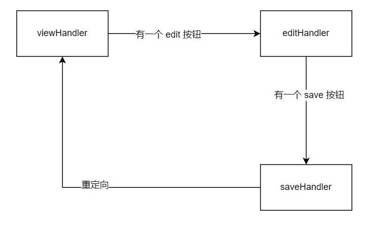

# 是什么
参考 go document 官方教程。[链接](https://go.dev/doc/articles/wiki/)

根据 go 官方教程完成的一个简单的 web 应用，实现功能：展示页面，编辑页面，存储 txt，读取 txt，正则验证等

# 目录结构
```go
D:.
│  go.mod
│  liliIntro.txt: lili 的个人介绍文件
│  main.go
│  README.md
│
├─model: 模型层
│      model.go: 页面的结构，存储操作，这里用的是 txt 文件，不是数据库
│
├─server: 服务器端
│      server.go: 路由操作
│
├─utils
│      regexp.go: 正则表达式工具
│      util.go: 模板渲染工具
│
└─views
        edit.html: 基础编辑页面
        view.html: 基础视图页面
```
# 控制层/路由层逻辑关系
